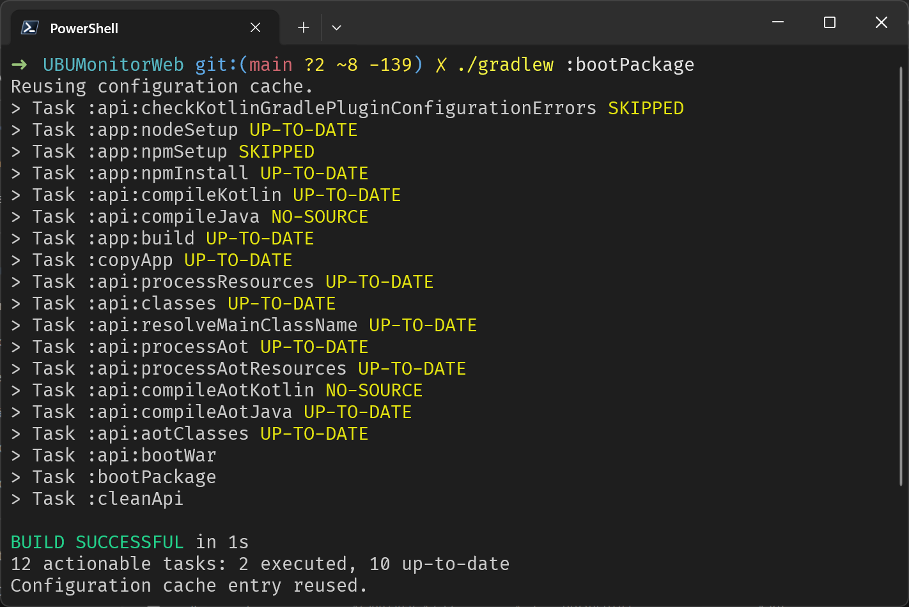
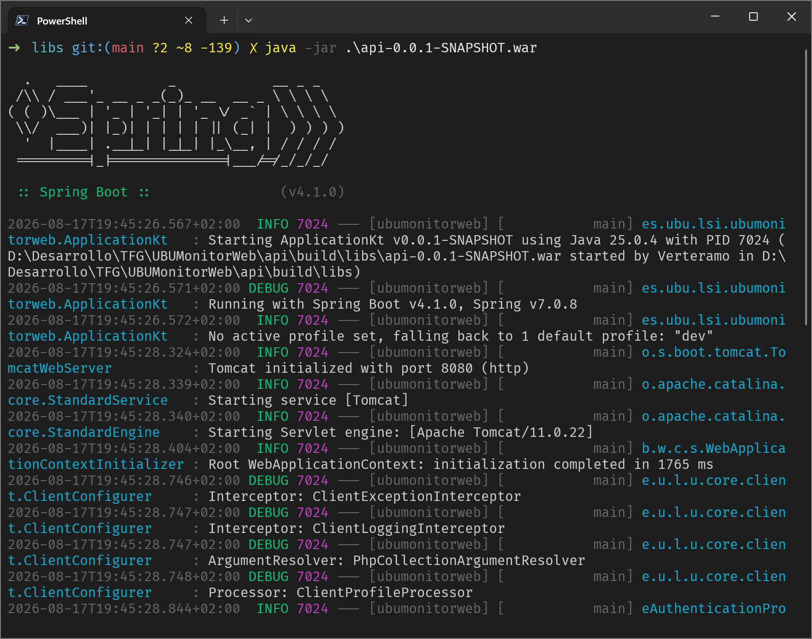
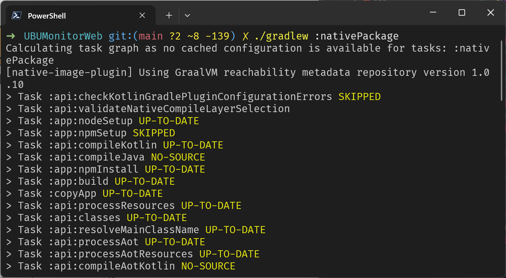
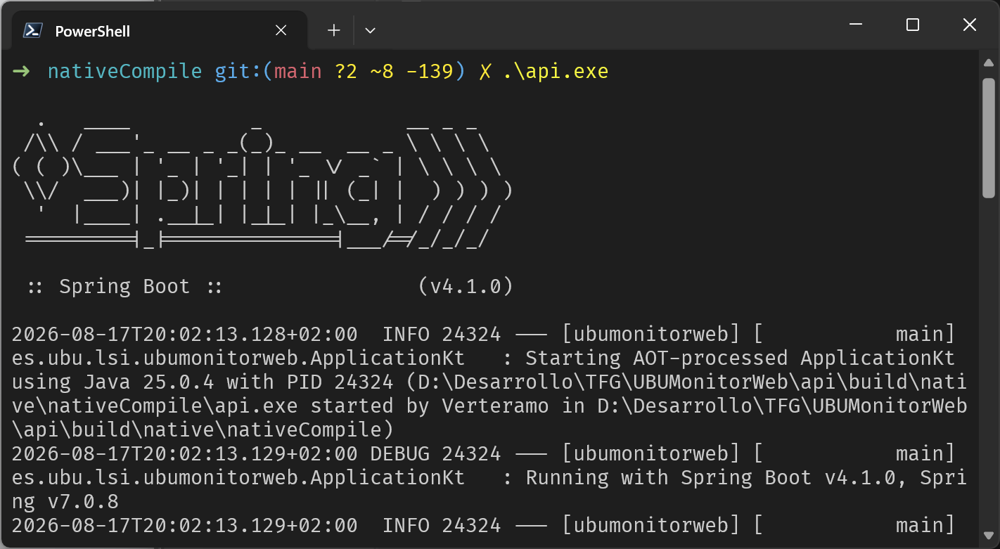
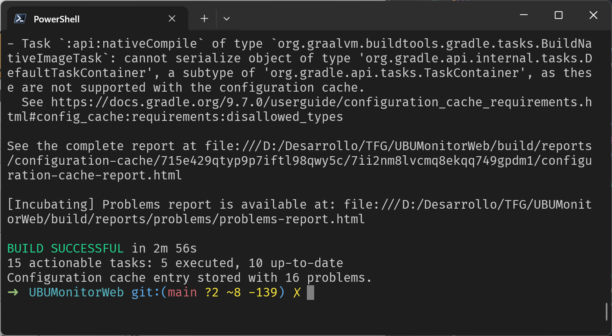
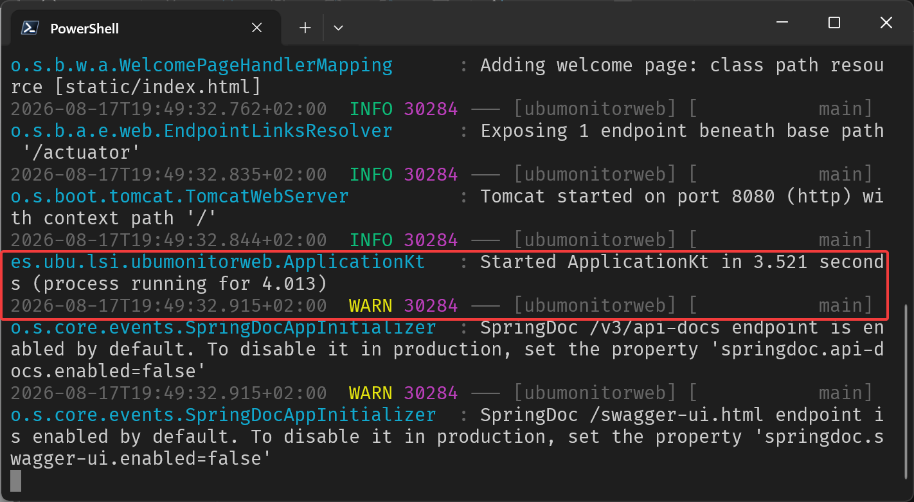
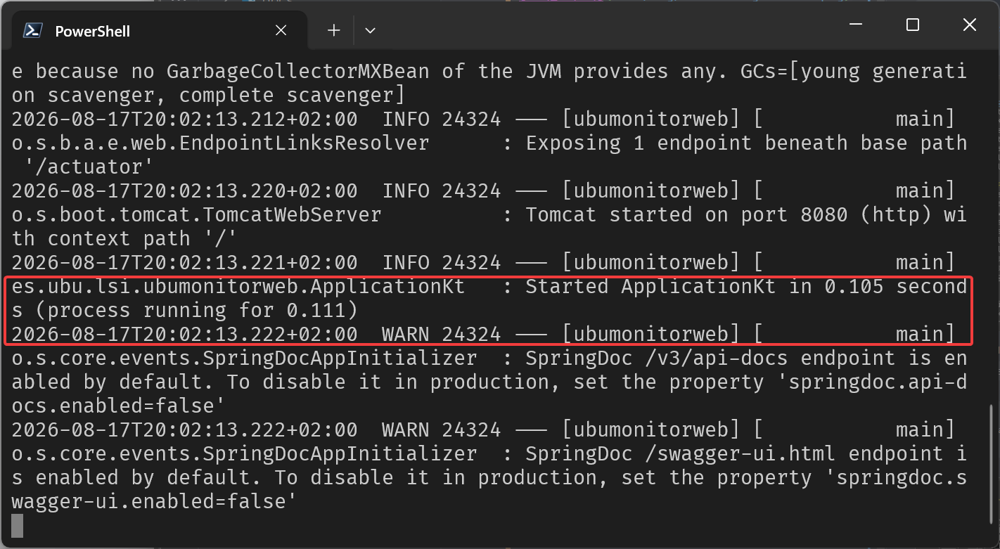

# UBUMonitorWeb

## Construir WAR
Construye un paquete WAR embebiendo la aplicación Angular en el directorio de recursos estáticos de la API Springboot:
```shell
./gradlew :bootPackage
```

Una vez ejecutado el distribuible (ubicado en el directorio `UBUMonitorWeb\api\build\libs`)`:
```shell
java -jar api-version.war
```

Se accede a `http://localhost:8080` y se encuentra la aplicación lista para su uso:


## Construir ejecutable nativo (GraalVM)
```shell
./gradlew :nativePackage
```

En este caso, se ejecuta el distribuible nativo (ubicado en el directorio `UBUMonitorWeb\api\build\native\nativeCompile`):

De igual manera, al acceder a `http://localhost:8080` se encuentra la aplicación en ejecución:


## Comparativa de tiempos de construcción
El paquete WAR se construye en poco tiempo.
Por su parte, el ejecutable nativo se construye en mucho más tiempo, por ejemplo, esta construcción particular necesitó 2 minutos 56 segundos:


## Comparativa de tiempos de inicio
El paquete WAR requiere una JVM en ejecución y se pone en funcionamiento en 4.013 segundos:

El paquete nativo tiene un tiempo de inicio muy inferior, de 0.111 segundos:


La conclusión final es que el paquete WAR (tarea `:api:bootWar`) es ideal para desarrollo por su bajo tiempo de construcción, y el paquete nativo es ideal para producción, ya que a pesar de su elevado tiempo de construcción, su tiempo de inicio y ejecución es muy inferior, gracias a GraalVM.
