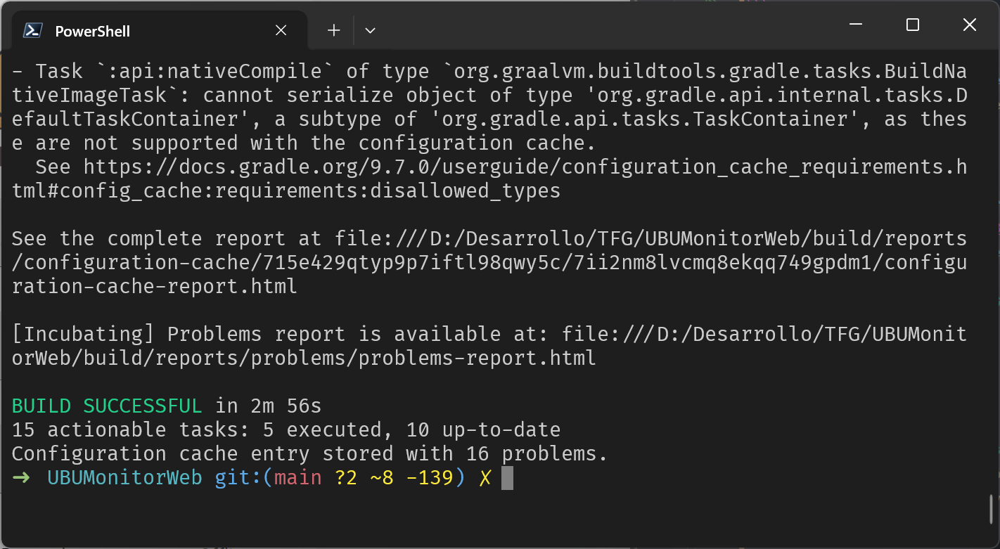
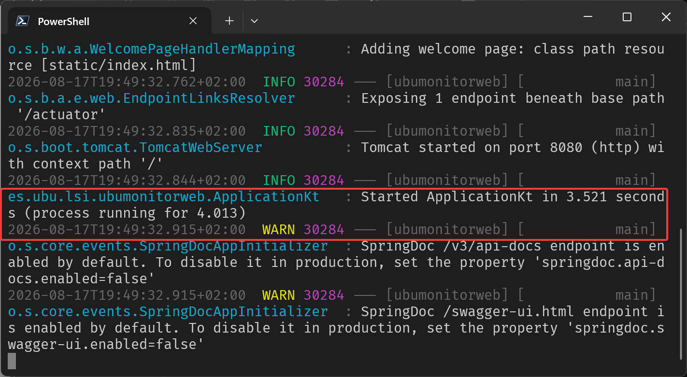
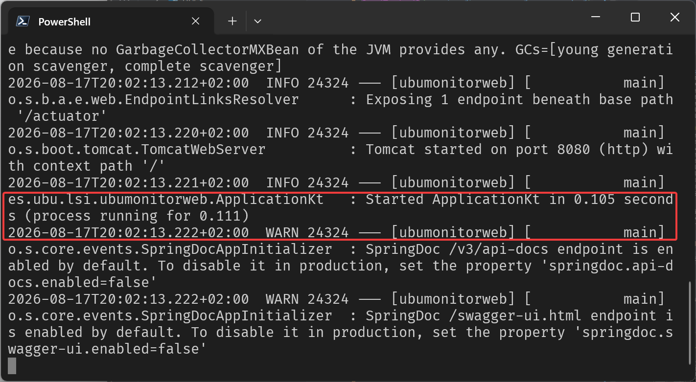

# UBUMonitorWeb
## Aplicación web de analítica de aprendizaje sobre registros de Moodle

[](https://sonarcloud.io/summary/new_code?id=verteramo_UBUMonitorWeb)


## UBUGrades/UBUMonitor
UBUMonitor versión escritorio (inicialmente UBUGrades) tiene, desde noviembre de 2017 hasta hoy, los siguientes contribuyentes:
- [Claudia Inés Martínez Herrero](https://github.com/claumartinezh/TFG_UBUGrades)
- [Félix Nogal Santamaría](https://github.com/claumartinezh/TFG_UBUGrades)
- [Raúl Marticorena Sánchez](https://github.com/rmartico/UBUGrades)
- [Yi Pen Ji](https://github.com/yjx0003/UBUMonitor)
- [Xing Long Ji](https://github.com/xjx1001/UBUMonitor)
- [Carlos López Nozal](https://github.com/clopezno/UBUMonitor)
- [Adrián (acqacq2000)](https://github.com/acqacq2000/UBUMonitor)
- [Ionut Catalin Marc](https://github.com/CatalinMarc/UBUMonitor)

La aplicación sigue recibiendo actualizaciones importantes como el soporte para autenticación SSO, entre otras.

UBUMonitorWeb pretende llevar las funcionalidades analíticas al entorno web, su propuesta es:

> La aplicación UBUMonitor permite conectarse a servidores Moodle para la extracción de datos y visualización de los mismos.
> Se dispone de una aplicación cliente de escritorio muy madura - desarrollada con Java y JafaFX - que se quiere migrar a
una solución web con SpringBoot (Java) y React. Esa migración implicaría la creación de un backend API REST.
>
> Dentro de todas las funcionalidades incluidas en UBUMonitor,
> en esta primera fase solo se aborda como objetivo la importación datos de Moodle para su visualización relativos a:
> cursos, participantes, actividades/recursos y fundamentalmente los logs.
> Se requiere un diseño modular, para permitir futuras extensiones del desarrollo actual en futuros proyectos.
>
> El despliegue de la aplicación web se realizará de manera similar al despliegue actual con
> un único fichero comprimido o autoextraíble y acceso local por parte del usuario, por motivos de protección de datos.

Cabe destacar que el stack tecnológico final es: Spring Boot (Kotlin DSL) y Angular.

## Trabajos teóricos relacionados
- [UBUMonitor: Desktop application for visual e-learning student clustering with Moodle](https://doi.org/10.1016/J.SOFTX.2024.101727)
- [Activity and Dropout Tracking in Moodle Using UBUMonitor Application](https://doi.org/10.1109/RITA.2022.3191279)
- [UBUMonitor: An Open-Source Desktop Application for Visual E-Learning Analysis with Moodle](https://doi.org/10.3390/ELECTRONICS11060954)
- [Monitoring of Student Learning in Learning Management Systems: An Application of Educational Data Mining Techniques](https://doi.org/10.3390/APP11062677)

## Construcción WAR
Construcción del paquete, embebiendo la aplicación Angular en el directorio de recursos estáticos de la API Spring Boot:
```shell
./gradlew :bootPackage
```
Ejecución del paquete (depositado en el directorio `UBUMonitorWeb\api\build\libs`):
```shell
java -jar api-version.war
```
Por defecto corre en el puerto: `http://localhost:8080`.

## Construcción ejecutable nativo (GraalVM)
```shell
./gradlew :nativePackage
```
En este caso, el distribuible nativo se deposita en el directorio `UBUMonitorWeb\api\build\native\nativeCompile`:
```shell
./api[.exe]
```
De igual manera, por defecto corre en el puerto: `http://localhost:8080`.

## Comparativa de tiempos de construcción
- El paquete WAR se construye en 1 segundo.
- Por su parte, el ejecutable nativo se construye en mucho más tiempo, por ejemplo, esta construcción particular necesitó 2 minutos 56 segundos:



## Comparativa de tiempos de inicio
- El paquete WAR requiere una JVM en ejecución y se pone en funcionamiento en 4.013 segundos:



- El paquete nativo tiene un tiempo de inicio muy inferior, de 0.111 segundos:



La conclusión final es que el paquete WAR (tarea `:api:bootWar`) es ideal para desarrollo por su bajo tiempo de construcción (1 segundo), y el paquete nativo (tarea `:api:nativeCompile`) es ideal para producción, ya que a pesar de su elevado tiempo de construcción (2 minutos 56 segundos), su tiempo de inicio y ejecución es muy inferior, gracias a GraalVM.
